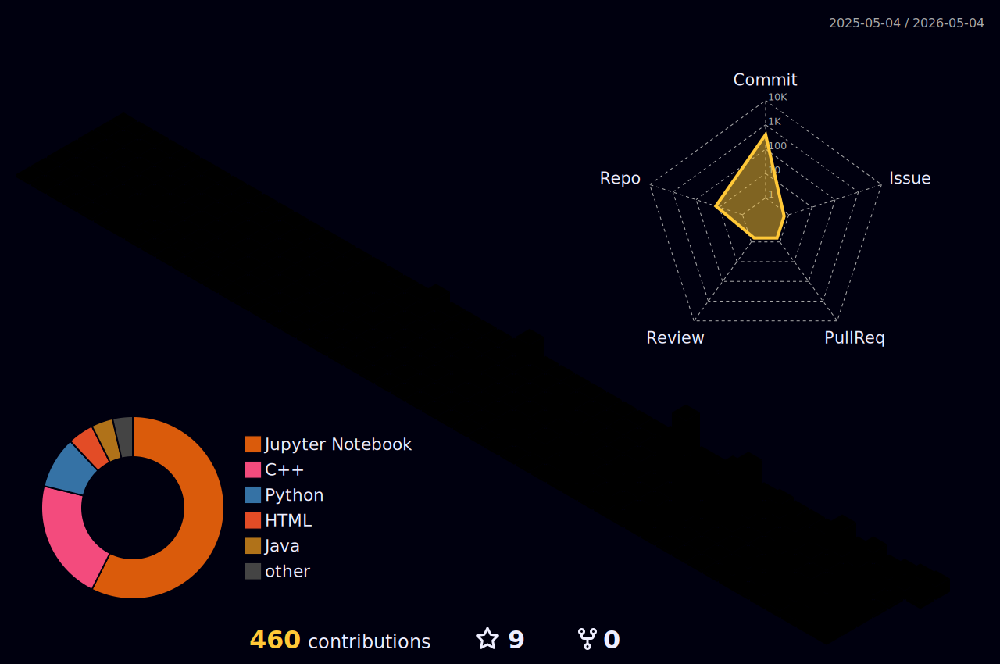

<h1 align="center">Out here rewriting the matrix. Anime obsessive, meme trafficker, and chaotic coder</h1>

<table border="0" cellpadding="0" cellspacing="0" width="100%">
  <tr>
    <td align="left" valign="top" width="55%">
       
       
      

        ⚙️ <strong>I use daily:</strong> <code>.py</code> <code>.ipynb</code> <code>.json</code> <code>.pkl</code> <code>.scaler</code> <code>.ann</code>  
        🔨 <em>"In theory, hyperparameters can be optimized systematically. In practice, I am just guessing numbers until the loss curve goes down."</em>  
        📫 <strong>Slide into my inbox:</strong> <strong>hello.isuladissanayake@gmail.com</strong>
      

       
      <h3 style="margin-top: 25px; margin-bottom: 10px;">🔌 Access Protocol</h3>
      
      
      
      
      
       
       
       
      <h3 style="margin-top: 25px; margin-bottom: 10px;">⚔️ Combat Gear</h3>
      <table>
        <tr>
          <td><strong>Programming Languages</strong></td>
          <td> &nbsp;  &nbsp;  &nbsp;  &nbsp; </td>
        </tr>
        <tr>
          <td><strong>Web Development</strong></td>
          <td> &nbsp; </td>
        </tr>
        <tr>
          <td><strong>AI / Machine Learning</strong></td>
          <td> &nbsp;  &nbsp;  &nbsp;  &nbsp;  &nbsp;  &nbsp;  &nbsp; </td>
        </tr>
        <tr>
          <td><strong>Databases & Backend</strong></td>
          <td> &nbsp;  &nbsp; </td>
        </tr>
        <tr>
          <td><strong>Hardware & OS</strong></td>
          <td> &nbsp;  &nbsp; </td>
        </tr>
      </table>
    </td>
    <td align="center" valign="top" width="45%">
      
       
      
       
      
    </td>
  </tr>
</table>

 

  
    
  

 

<h3 align="center">Read my Latest Article on Medium:</h3>

  

