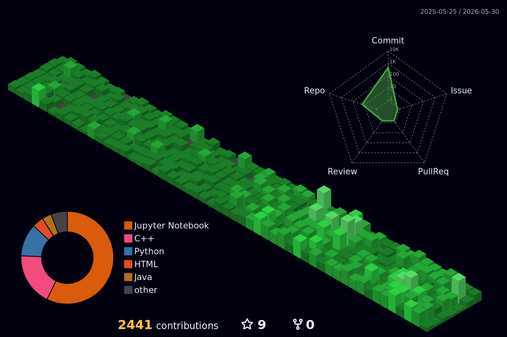

<h1 align="center">Yoo, It's Your friendly neighborhood chaotic coder, anime obsessive, meme distributor</h1>

- Experimenting with **AI, Automation and Robotics**

- Currently learning **State of Art Models, Transformers and Neural Netwoks**

- Reach me at: **hello.isuladissanayake@gmail.com**

<h3 align="left">Connect with me:</h3>

  
  
  
   
  <a href="https://medium.com/@heyisula target="_blank">
  

<h3 align="left">Languages and Tools:</h3>

  
  
  
  
  
  
  
  
  
  
  
  
  
  
  
  
  
  
  
  
  
  
  
  
  
  
  
  
  
  
  
  
  
  
  
  
  
  
  
  
  
  
  
  
  
  
  
  
  
  
  
  
  
  
  
  
  
  
  
  
  
  
  
  
  

 
<h3 align="center">Github Stats:</h3>

  
  

  

 

  

 
<h3 align="center">Read my Latest Article on Medium:</h3>

  

